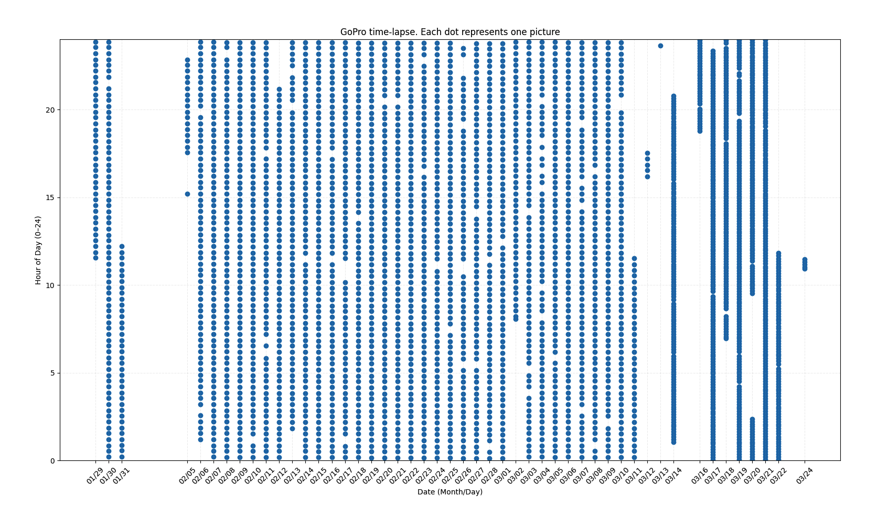

`

                     .d8888b.           8888888b.                                     
                    d88P  Y88b          888   Y88b                        o           
                    888    888          888    888                       d8b          
                    888         .d88b.  888   d88P 888d888  .d88b.      d888b     ©    
                    888  88888 d88""88b 8888888P"  888P"   d88""88b "Y888888888P"     
                    888    888 888  888 888        888     888  888   "Y88888P"       
                    Y88b  d88P Y88..88P 888        888     Y88..88P   d88P"Y88b       
                     "Y8888P88  "Y88P"  888        888      "Y88P"   dP"     "Yb      
        88888888888 d8b                        888                                    
            888     Y8P                        888                                    
            888                                888                                    
            888     888 88888b.d88b.   .d88b.  888  8888b.  88888b.  .d8888b   .d88b. 
            888     888 888 "888 "88b d8P  Y8b 888     "88b 888 "88b 88K      d8P  Y8b
            888     888 888  888  888 88888888 888 .d888888 888  888 "Y8888b. 88888888
            888     888 888  888  888 Y8b.     888 888  888 888 d88P      X88 Y8b.    
            888     888 888  888  888  "Y8888  888 "Y888888 88888P"   88888P'  "Y8888 
                                                            888                       
                                                            888                       
                                                            888  script by @mrbigheart

`

# Abstract

*Did you ever want to create an ultra-long time-lapse without special equipment? I'm using here a 
GoPro Hero5 Black ..which as of 2025 is already very old :)*
 
 
*This project provides a Python-based solution to automate the entire workflow, with the help of a Raspberry Pi (v4 in this case). 
It handles wifi switching between the rpi and the GoPro, configurable periodic photo captures, 
keeps the system time in sync and even sends alerts if something goes wrong. Most of this is configurable.
Designed to run continuously with the help of `timelapse.service`, it ensures the timelapse runs 
smoothly for extended periods with minimal intervention (hopefully none).*

*This was designed for a six month timelapse, taking three photos per hour. But feel free to adapt it.*

 
 

# Features

### **Waiting..**
This is where we spend most of the time. We check if it's time to take a photo or time to keep the wifi alive.
 
 
The script starts in `WAITING`, and connects to the GoPro wifi. Every 5 seconds, it checks if is time to take a photo.
If it’s not time, it will call `keep_alive()` and keep the GoPro wifi available. This is the most important part of the 
script because the GoPro will go to sleep after a few minutes of inactivity. If this happens.. there's no way to get it 
back. See the error handling, lower. But, as the script is written now, this doesn't happen even if the power goes out 
for 1..2 minutes.

### **Taking the photos**
When it's time to take a photo, the script transitions to `TAKE_PHOTO`. If the rpi isn’t on the GoPro wifi, it switches,
wakes up the camera, takes a photo, then we transition to `SEND_UPDATE`.

### **Sending updates**
Once a photo is taken, depending on the time, script switches to your router wifi (`SEND_UPDATE`), synchronizes the system 
time and sends a status push to user (the time sync and the user notification happen once every hour), saves the state 
and then switches back to the GoPro wifi (`WAITING`) to keep it alive. So also the wifi switch to the main router happens 
every hour. 

### **Error handling**
If there is a file missing, we can't sync the time.. or we get (mostly) any other error, the script doesn't fail. BUT! 
If we can't connect to the GoPro wifi.. which is the most important thing, the script goes to `ERROR` where retries a 
few times, and if it is still failing.. it goes into `OFFLINE_ALERT`. This means it sends push notifications every twenty 
minutes, until connectivity is restored. But this needs user intervention. Unfortunately, the GoPro can't be 'restarted'. 
Or, I couldn't find a way to do this.  *So, if you're going to use this script, you need to be aware of this!*

### **systemd**
A systemd unit file `timelapse.service` runs this script at boot. Beware of permissions and all that.
Also, there's a `crontab` that makes sure this doesn't get stuck in a GoPro operation. I've removed the photo count,
for example, because this will get stuck, every now and then, with no warning. And it'll halt the script. But the cronjob
will restart the service if it's not writing in the logs for more than 40 seconds.

## Good to know

The rpi is isolated most of the time, from the outside world. That's why we sync the time and we send push notifications
once an hour. This is to make sure the rpi is still alive and kicking. If we need to change the behavior remotely, we can
create an AWS server that can be checked every time we 'surface' and if so, we download and replace the new config.
Unless you keep the setup in a remote location.. or need to vary the time, this is not needed. But it's an idea. 
This would be nice if you also add video capabilities and you want it to take a video when you're not around.
 
 
But, if you *do have* an use-case where you have to mess with the config remotely, then you can move some of those values in 
the `keep_alive` array, to the `photo_timer` array. Keep track of these and make sure the downtime is not too long! Some 
testing needs to be done, but it should work without any other changes. The thing is.. the GoPro wifi will go to sleep after a 
few minutes of inactivity. Around 4 or 5. Even if you leave it turned on. I kept saying this.. _you need to keep the wifi alive_. 
If you tick the box in the Quick App, that says it'll never go to sleep.. the GoPro won't, but the wifi will. And you can't wake 
it up remotely. So.. just keep the wifi alive! 
Right. I'll stop now.

### Specs
Check the specs folder to see how one-hour cycle looks like.
  Don't try to get a count of the photos. It'll get stuck. Randomly. I've removed that part.
  Passwords are base64 encoded. There's a script that does this for you. Use it. Don't keep passwords in plain text. 
Not cool.
 
 

Enjoy! :)

P.S. _If you're gonna' whine about the monkey-patch or the ASCII art.. save it! 
I like it._

 
 
 

### **March update (~2 months after launch):** 
The script now takes 7 pictures every hour. Just 3.. felt like it's not enough. The sunsets are barely captured.. but also
the whole point of this was to see the trees bloom. 

Sadly.. the GoPro api is not thaaat reliable. It's not the script. It's the GoPro.  So I have to manually restart the GoPro, 
turn the wifi on and off and then restart the script, every two weeks. You get notified.. so it's not a big deal. But it's annoying.

Also, I added a tiny OLED (SSD1306) of 128x64 pixels, to show the status of the time-lapse. I find it very useful to be able
to keep an eye on it, since you can't login to the rpi. On that tiny screen I update an array of symbols, that show
the status of the script. Each symbol is a different minute. Also, a special screen for the `OFFLINE` state. The script
looks through the logs, with an AWK script, and if it finds the `PHOTO` state, it shows a special symbol, etc.

### **2nd March update (big refactoring):** 
Timelapse now has a `lib` folder, where all the cool stuff is happening. The main script is now clean and easy to read,
hopefully. Heartbeat looks for a different keyword to show when a picture is taken, more reliable. 
Tests will follow. I promise.

### **3rd March update (plotting data gathered so far):** 

  